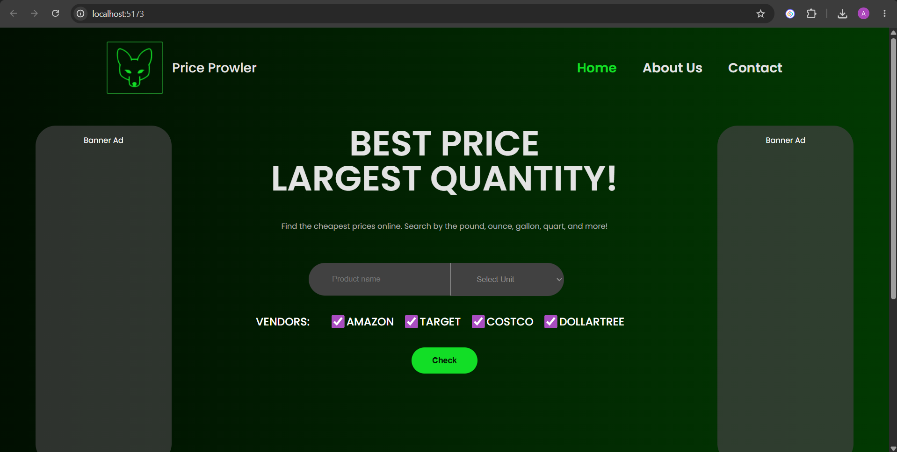
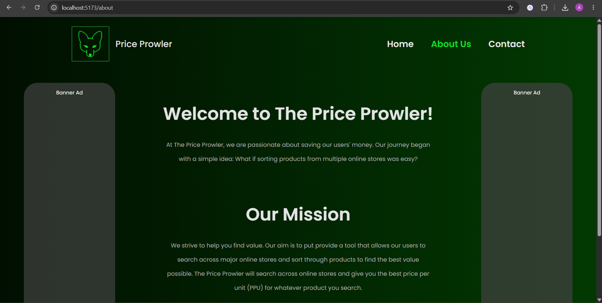
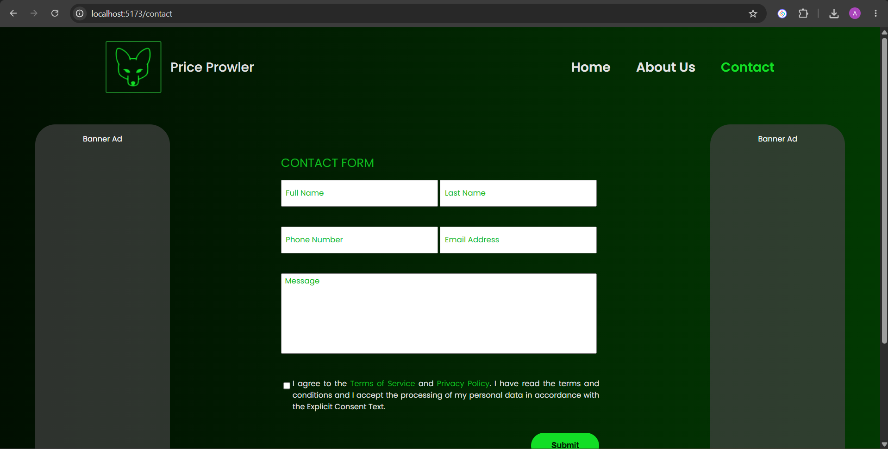

# Price Prowler

A modern, responsive web application for tracking and visualising product prices.

---

## Screenshots







---

## Features

- Real‑time price monitoring
- Interactive charts powered by `framer-motion` and `swiper`
- Search & filter capabilities
- Responsive UI built with **React 18**

---

## Tech Stack

- **React** – UI library
- **Vite** – Fast development server & bundler
- **Axios** – HTTP client for API calls
- **React Router** – Client‑side routing
- **Framer Motion** – Animations
- **Swiper** – Carousel/slider components

---

## Installation

```bash
# Clone the repository (if not already)
git clone <repository‑url>
cd Price_Prowler

# Install dependencies (Yarn is recommended because a yarn.lock is present)
# npm install is also supported
yarn install   # or: npm install
```

---

## Available Scripts

| Script | Command | Description |
|--------|---------|-------------|
| `dev` | `yarn dev` (or `npm run dev`) | Starts the Vite dev server – typically <http://localhost:5173> |
| `build` | `yarn build` (or `npm run build`) | Generates a production‑ready bundle in the `dist/` directory |
| `preview` | `yarn preview` (or `npm run preview`) | Serves the built `dist/` locally for a quick production preview |

---

## Running Locally

```bash
# Start development server
yarn dev   # or: npm run dev
```
Open the URL shown in the terminal (usually <http://localhost:5173>) in your browser.

---

## Building for Production

```bash
yarn build   # or: npm run build
# To preview the production build
yarn preview   # or: npm run preview
```

---

## Contributing

Feel free to open issues or submit pull requests. Please follow the existing code style and run `yarn lint` (or equivalent) before committing.

---

## License

This project is licensed under the **MIT License**. See the `LICENSE` file for details.
